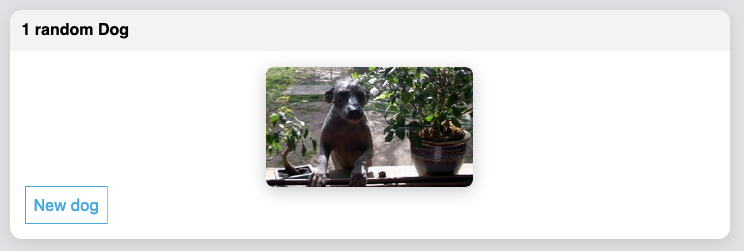

# HUB ME

## Introduction

Le Document Object Model (DOM) est une interface de programmation pour les documents HTML, XML et SVG. Le DOM fournit une représentation du document comme un groupe structuré de nœuds et d'objets qui ont des propriétés et des méthodes. Les nœuds peuvent également être associés à des gestionnaires d'événements, et une fois que cet événement est déclenché, les gestionnaires d'événements sont exécutés. Essentiellement, il relie les pages Web aux scripts ou aux langages de programmation.

Le DOM a deux principaux problèmes lorsqu'on l'utilise pour construire des applications :

1. Le manque d'encapsulation:

- Angular ou les webcomponents utilisent **Shadow DOM**
- Vue ou React utilisent leur propre modèle de composants
- Svelte utilise une technique de scoping css

2. De mauvaise performance pour modifier l'arbre de noeuds

- Vue comme React utilisent un Virtual DOM : Le Virtual DOM est une abstraction du HTML DOM. Il est léger et détaché des détails d'implémentation spécifiques au navigateur. Puisque le DOM lui-même était déjà une abstraction, le DOM virtuel est, en fait, une abstraction d'une abstraction.

Le développement d'application web fait apparaitre le besoin de pratiques de développement. Là aussi 2 approchent se distinguent :

1. L'approche par _templating_, c'est à dire une séparation de la gestion du rendu (template) et du comportement d'un composant. Cette approche est celle de HTML, Vue, Angular, Webcomponent ou Svelte.

2. L'approche _composable_, c'est à dire la capacité de composer les IHM comme des fonctions à partir d'une unité qui est le composant. Cette apporche est celle de React dès 2013.

## React

Pour ce TP nous allons réaliser une application [React](https://reactjs.org/) en ReasonML.
Pour cela nous utiliserons la toolchain [buckelscript](https://bucklescript.github.io/), qui permet de compiler du ReasonML vers du Javascript, ainsi que la librairie [ReasonReact](https://reasonml.github.io/reason-react/) qui fournit les bindings javascript pour ReasonML.

#### Play with interop

Vous pouvez faire des essais sur le [TRY](https://reasonml.github.io/en/try) de ReasonML pour voir le code JS généré par Buckelscript (et au passage son équivalent OCaml).

Par exemple :

```reason
/* js unicode string */
let icn_cheers = {js|🍻|js};

/* binding to a global value */
type timerId;
[@bs.val] external setTimeout : (unit => unit, int) => float = "setTimeout";
[@bs.val] external clearTimeout : float => unit = "clearTimeout";

/* bind a global module */
[@bs.scope "Math"] [@bs.val] external random : unit => float = "random";


/* and use tem */
let someNumber = random();
setTimeout( _ => Js.log(someNumber), 1000);

/* Hangle Null or Undefined */
let jsNull = Js.Nullable.null;
let jsUndef = Js.Nullable.undefined;


/* deal with variadic function */
[@bs.val] [@bs.variadic] external log: array(string) => string = "console.log";
let v = log([|"a", "b"|]);

/* ... just an overview of BS capacities ... */
```

Buckelscript fournit native plusieurs modules de bindings :

- [Belt](https://bucklescript.github.io/bucklescript/api/Belt.html) : the BuckleScript standard library (beta). Cette librairie fournit des fonctions utilitaires orientées "JS".
- [Dom](https://bucklescript.github.io/bucklescript/api/Dom.html): DOM types.
- [Node](https://bucklescript.github.io/bucklescript/api/Node.html): pour les APIs notde. Experimental !
- [Js](https://bucklescript.github.io/bucklescript/api/Js.html) : toutes les APIs usuelles JS! Il est possible par exemple d'utiliser l'API JS Array plutôt que le module Array de ReasonML... Ce n'est pas un problème mais dans ce cas ce code ne compilera pas en natif.

BS fournit également un nouvel opérateur `->` (pipe first). Il fonctionne de manière similaire au pipe `|>` si ce n'est que l'expression à gauche est injectée comme paramètre le plus **à gauche** de l'expression droite (vs le pipe qui injecte comme paramètre le plus à droite)

### Run

```sh
npm install
npm run dev
```

Ouvrir un nouvel onglet sur `http://localhost:8000/`.

Quand vous modifier un fichier `.re` dans `src` la page est rechargée.

Si vous utilisez VSCode, je vous recommande d'installer le plugin [reason-vscode](https://marketplace.visualstudio.com/items?itemName=jaredly.reason-vscode) qui est préférable pour les projets utilisant Buckelscript. Désactivez `OCaml and Reason IDE` si vous l'aviez installé (qui est lui préférable pour les projets natifs).

N'hésitez pas à consulter `Index.re` pour voir comment les composants sont ajoutés au DOM.

### Premier composant

Un premier composant `Greeting.re` qui ne fait pas grand chose

```reason
[@react.component]
let make = _ => {
    let atom = {js|ReasonReact makes ⚛️ UI |js};

    <div> {React.string(atom)} </div>;
};
```

Le snippet `[@react.component]` permet de déclarer un composant nommé comme le module le contenant, le composant en lui même est défini par une fonction `make` qui prend en paramètre les propriétés du composant et retour un `reactElement`.

### Children and Hooks

#### Un second composant `BlinkingGreeting.re`

```reason
[@react.component]
let make = (~children) => {
  let (show, setShow) = React.useState(() => true);

  // Notice that instead of `useEffect`, we have `useEffect0`. See
  // reasonml.github.io/reason-react/docs/en/components#hooks for more info
  React.useEffect0(() => {
    let id =
      Js.Global.setInterval(
        () => setShow(previousShow => !previousShow),
        1000,
      );

    Some(() => Js.Global.clearInterval(id));
  });

  let style =
    if (show) {
      ReactDOMRe.Style.make(~opacity="1", ~transition="opacity 1s", ());
    } else {
      ReactDOMRe.Style.make(~opacity="0", ~transition="opacity 1s", ());
    };

  <div style> children </div>;
};
```

Un pattern courant en react est d'utilisé une propriété Children qui est elle-même un reactElement afin de composer de manière déclarative une interface. Cette propriété correspond à tout ce qui est entre les balises JSX quand le composant est appelé.

On constate également deux fonctions particulières `useState` et `useEffect`.
Il s'agit de [Hooks](https://reactjs.org/docs/hooks-overview.html).

Un composant React possède des propriétés, passées en paramètre de la fonction `make` et fournis par les paramètres du tag JSX et des états, initialisés par le hook `useState` et modifié par la fonction `setXXX` retourné par useState. A chaque fois qu'une propriété ou un état est modifié, le composant est redessiné, de manière intelligente grâce au VDom.

Le second Hook `useEffect0` permet de gérer un effet au montage du composant et retourne une fonction de nettoyage qui sera exécutée lorsque le composant sera démonté.

#### Un troisième composant `ReducerFromReactJSDoc.re`

Lorsque l'état du composant ou la gestion de son cycle de vie se complexifie, l'utilisation de `useState` peut s'avérer pénible. Il est possible d'utiliser le pattern `reducer` facilement grace au Hook `useReducer` (c'est un modèle acteur appliqué à la gestion de l'état interne du composant).

#### Un quatrième composant `ReducerFromReactJSDoc.re`

Vous devriez maintenant être capable de comprendre ce composant qui fetche une API distante pour afficher des photos de chiens.

###### EXERCICE 1 :

Créez un composant `FetchedRandomDog.re`.


Ce composant récupère une image de chien au hasard. Quand on clique sur "new dog", l'état évolue pour afficher un nouveau chien.

### Bundle for Production

Pour la production, il est nécessaire de construire un bundle, le projet est paramaétré avec webpack.

```sh
npm run bundle
open indexProduction.html
```

### Handle Routing Yourself

ReasonReact dispose d'un [router](https://reasonml.github.io/reason-react/docs/en/router) qui peut vous intéresser pour le suite.

###### EXERCICE 2 :

Créez un racine de menu et faites une page pour chacun des composants du projet.

## GraphQL

[GraphQL](https://graphql.github.io/) est un langage de requete d'API permettant des `queries` (requetes en lecture), des `mutations` (modifications) et des `notifications` (en quelque sorte des queries reactives).

Nous allons utliser l'[API de Github](https://developer.github.com/v4/) pour explorer GraphQL. Commencez par créer un token pour utiliser l'API : https://developer.github.com/v4/guides/forming-calls/#authenticating-with-graphql

Le premier intérêt de graphQL est que nous avons un end-point unique : https://api.github.com/graphql

Vous pouvez tester votre token :

```sh
curl -H "Authorization: bearer mytoken" -X POST -d " \
 { \
   \"query\": \"query { viewer { login }}\" \
 } \
" https://api.github.com/graphql
```

Vous pouvez ensuite utiliser https://graphiql-online.com/graphiql pour explorer l'API github.

### Urql

Pour requêter l'api GraphQL dans notre application, je vous propose d'utiliser la librairie [URQL](https://formidable.com/open-source/urql/) qui dispose déjà de [bindings Buckelscript](https://github.com/FormidableLabs/reason-urql)

Liser le Readme et consulter les exemples pour intégrer cette librairie à votre projet.

###### EXERCICE 3 (query) :

Créez un nouveau composant qui affiche votre nom, avatar,votre status, votre nombre de follower et votre nombre de following récupérés grâce à l'API Github.

###### EXERCICE 4 (mutation) :

Créez un nouveau composant qui permette de modifier votre status Github depuis un champ de saisie.

##### SETUP

1. Install ReasonUrql :

- `npm i reason-urql bs-fetch`
- `npm i -D @baransu/graphql_ppx_re`

2. Update **bsconfig.json** :

```json
...
  "bs-dependencies": ["reason-react", "reason-urql"],
  "ppx-flags": ["@baransu/graphql_ppx_re/ppx6"],
...
```

3. Generate the schema of github api

- `npx get-graphql-schema https://api.github.com/graphql -h 'Authorization=Bearer mytoken' -j > graphql_schema.json`

4. Rebuild

- `npx bsb -clean-world`
- `npx bsb -make-world`

##### Mettre en production

Nous avons travaillé avec `moduleserve` en développement, un serveur de développement bien pratique quand on travaille sur une SPA. Ce serveur n'est pas destiné à être utilisé en production. Vous avez d'ailleurs identifié une limite quand vous avez eu besoin d'utiliser votre token Github, vous avez du l'exposer dans votre code, ce qui induit une faille de sécurité si vous comittez en l'état.

Pour mettre en production une SPA, vous pouvez devez générer un asset statique, pour cela j'utilise [Webpack](https://webpack.js.org/) qui est pré-configuré ici, vous remarquerez que j'utilise également [babeljs](https://babeljs.io/) dont rôle est de transpiler le code javascript vers un code qui garantie une compatibilité avec la majorité des navigateurs.

Avec Webpack, il est possible d'utiliser le plugin dotenv qui injectera le contenu d'un fichier `.env` dans votre page. Ca vous permet de tester avec votre token, sans le commiter. Dans une application réelle, le token de production serait probablement injecté par une variable d'environnement présente dans la CI/CD.

> Babel est nécessaire car nous utilisons les modules commonjs. Nous pourrions nous en passer en ciblant les modules es6, pour cela il suffit de remplacer dans **bsconfig.json** la ligne `"module": "commonjs,"` par `"module": "es6,"`. Cependant à date de ce TP la compatibilité des navigateurs avec les modules es6 reste jeune, c'est pourquoi je préfère encore utiliser babel.

Pour déployer vous avez le choix entre :

- Soit un hébergement statique, type Github pages, auquel cas il suffit de pousser le contenu du répertoir `bundleOutput`
- Soit déployer vous même un serveur statique. Je vous fourni un code d'exemple avec un serveur codé avec **express** dans `server/index.js`

Pour tester en local (voir scripts dans package.json) :

1. `npm run build` : rebuild `src/**/*.re` -> `src/**/*.bs.js`
2. `npm run bundle` : bundle `src/**/*.bs.js` -> `bundleOutput/index.js`
3. `npm start` : démarre le server qui sert `bundleOutput/index.html`

##### Développer des composants

Quand on développe des composants, il est très pratique de pouvoir les visualiser indépendemment de l'application. Je vous met à disposition [storybook](https://storybook.js.org/) pour cela.

- `npm run storybook` démarre un serveur storybook sur le port 6006

Je vous ai configuré des stories pour visualiser les composants de ce TP. Vous pouvez jouer avec les propriétés des composants depuis storybook grâce à l'[addon knobs](https://github.com/storybookjs/storybook/tree/master/addons/knobs)

Ce TP est un premier tour d'horizon du développement d'une application front-end de type Single Page Application et orientée composant. Pour avoir un flux de développement fluide, je vous recommande deux pratiques que nous n'avons pas mis en oeuvre ici, mais très simple :

1. Intégrer le style dans le composant plutôt que dans la cascade CSS, afin de pouvoir valider son rendu dans storybook. [Comment faire avec ReasonReact ?](https://reasonml.github.io/reason-react/docs/en/style)

2. Séparer vos composants en :

- composants de rendu, c'est-à-dire qui ne gère que de l'affichage à partir de données issues des propriétés du composant.
- composant **container** de données, c'est-à-dire qui s'occupe de récupérer les données depuis le contexte ou une API pour les fournir en propriétés de composants de rendu.

C'est l'approche proposée dans la correction avec le composant de rendu `Profile` et le composant container `Github`.
